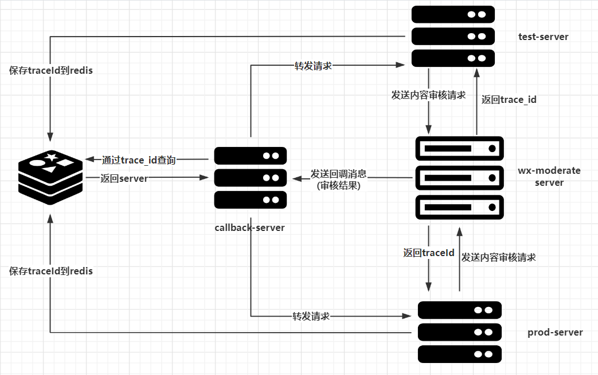
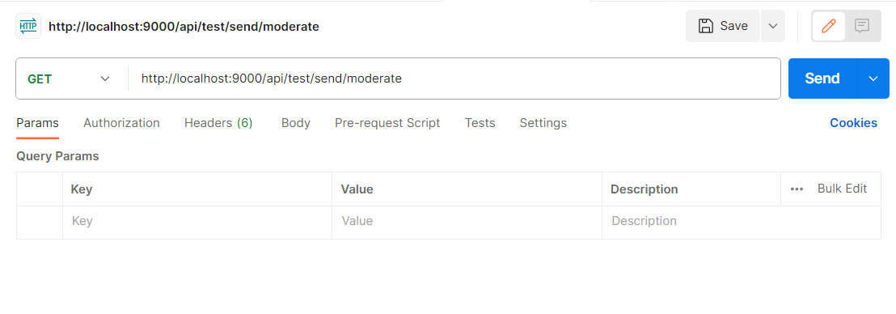
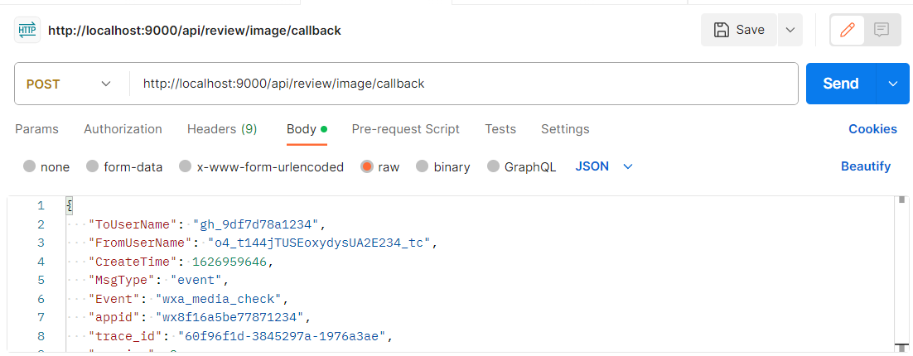
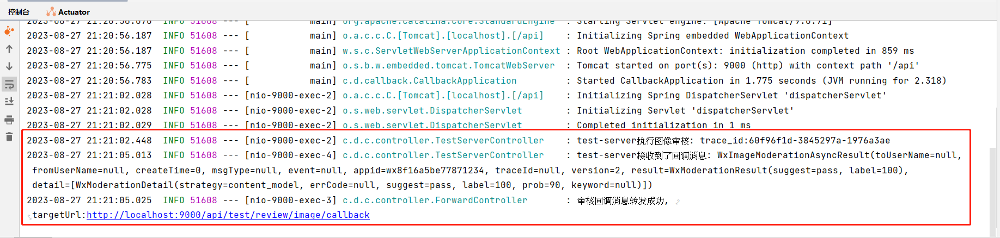

# 回调系统
## 背景
回调系统是我们处理异步操作的机制，它通常用于接收异步服务的回调请求，并将请求转发到指定的处理程序。回调系统可以帮助我们处理异步服务所带来的挑战，包括处理来自多个异步服务的请求，并确保每个请求都得到了正确的处理。
在一个典型的回调系统中，我们可以为每个异步服务定义一个回调URL，当服务完成处理并准备发送回调请求时，它会向这个URL发送一个请求。这个请求包含异步服务所返回的数据，我们的回调系统会接收这个请求并解析其中的数据，然后根据我们的业务逻辑，将数据转发到相应的处理程序。这个处理程序可能是我们自己的服务器，也可能是另一个异步服务，我们的回调系统需要负责将请求正确地转发到目标处理程序。
例如微信的图像审核就是一个异步的服务，当我们发送一个图像审核的请求给微信后，他会返回一个追踪id用于后续的图像审核追踪。一段时间后微信会自动给一个回调地址发送图像审核的接口。回调系统就是要接收回调的审核，并发送到相关服务的链接上

## 功能
核心功能：
- 接收第三方的回调数据（目前是腾讯的服务，后续会有其他的），然后转发到我们的服务器上
- 可以添加、修改、删除、查询回调地址的映射
- 回调地址的映射存储在mysql中
非系统功能：腾讯的回调使用miniapp库

## 相关文档
微信图像审核
https://developers.weixin.qq.com/miniprogram/dev/OpenApiDoc/sec-center/sec-check/mediaCheckAsync.html
miniapp微信小程序库
https://github.com/binarywang/weixin-java-miniapp-demo

## 基本流程

1. 客户端发送图像审核请求
2. **业务server**向微信内容审核服务器发送审核请求, 获得trace_id
3. 将`trace_id`写入redis , 格式为 `callback:moderate:${target_id} : ${回调消息接口url}`
4. 微信内容审核服务器将审核结果发送到**callBack server**
5. **callBack server** 通过`target_id` 获取真正的 **回调消息接口url**
6. **callBack server** 将请求转发给 真正的 **回调消息接口url**
7. 业务server接收回调消息 , 执行审核操作

**补充点**

1. **HTTPS不能在访问路径中填写确定的port**  , 比如应该使用`http://localhost:9000/api/prod/review/image/callback` 而不是 `https://localhost:9000/api/prod/review/image/callback`
2. 可以在**callBack**中自定义扩展其他操作
3. 在**callBack**中设置重试机制 , 确保业务server正确接收到了回调消息



## 测试

### 准备工作

**修改application.properties文件,  配置redis地址**

### 测试流程

`com.danxiaocampus.callback.controller`中的 `ProdServerController`  以及 `TestServerController`分别用来模拟正式服务器与测试服务器。

1.  通过向`http:localhost:9000/api/${environment}/send/moderate`  请求来模拟**发送审核请求**
2.  通过向`http:localhost:9000/api/review/image/callback`  请求来模拟**微信服务器发送回调消息**

查看控制台日志信息

```bash
2023-08-27 20:58:08.934  INFO 53608 --- [nio-9000-exec-2] c.d.c.controller.TestServerController    : test-server执行图像审核: trace_id:60f96f1d-3845297a-1976a3ae
2023-08-27 20:58:10.500  INFO 53608 --- [nio-9000-exec-4] c.d.c.controller.TestServerController    : test-server接收到了回调消息: WxImageModerationAsyncResult(toUserName=null, fromUserName=null, createTime=0, msgType=null, event=null, appid=wx8f16a5be77871234, traceId=null, version=2, result=WxModerationResult(suggest=pass, label=100), detail=[WxModerationDetail(strategy=content_model, errCode=null, suggest=pass, label=100, prob=90, keyword=null)])
2023-08-27 20:58:10.513  INFO 53608 --- [nio-9000-exec-3] c.d.c.controller.ForwardController       : 审核回调消息转发成功, targetUrl:http://localhost:9000/api/test/review/image/callback
```

**测试数据**

回调消息数据

> ==确保此条内容以代码中 **trace_id** 相同==

```json
{
   "ToUserName": "gh_9df7d78a1234",
   "FromUserName": "o4_t144jTUSEoxydysUA2E234_tc",
   "CreateTime": 1626959646,
   "MsgType": "event",
   "Event": "wxa_media_check",
   "appid": "wx8f16a5be77871234",
   "trace_id": "60f96f1d-3845297a-1976a3ae",
   "version": 2,
   "detail": [{
        "strategy": "content_model",
        "errcode": 0,
        "suggest": "pass",
        "label": 100,
        "prob": 90
   }],
   "errcode": 0,
   "errmsg": "ok",
   "result": {
        "suggest": "pass",
        "label": 100
   }
}
```

### 示例

- 以下使用postman进行测试

1. 模拟**发送审核请求**

2. 模拟微信回调消息



3. 在控制台查看日志信息

   